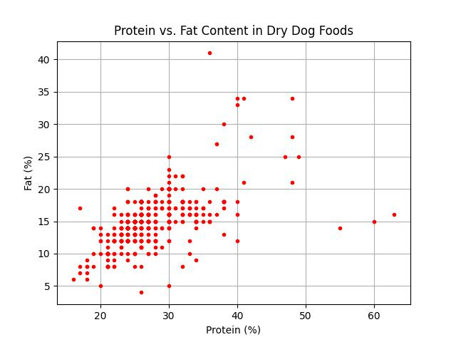

# Kibble Nutritional Data Analyzer

High-fat food can be particularly harmful to dogs, especially breeds like Schnauzers, which are prone to pancreatitis—an inflammation of the pancreas often triggered by a diet high in fat. If a dog consumes too much fat, the pancreas can become overworked and inflamed, leading to severe pain, vomiting, diarrhea, and potentially life-threatening complications. Monitoring fat intake is crucial to prevent these issues.

The ideal nutritional distribution for dogs varies depending on factors such as activity levels, breed, and habits. For example, a fat content of 10-15% is recommended for Schnauzers. More active dogs may require higher carbohydrates and lower fat and protein, while a protein content of at least 8% in their diet is generally advised. Choosing kibbles with the right nutritional balance—low in fat and high in quality protein—can help prevent health problems. However, with so many brands and kibbles available, it can be challenging to consider all options.

This project addresses that challenge by displaying the fat and protein contents in various kibbles, helping you choose the right one for your dog. It scrapes nutritional data (protein and fat content) from 450 different kinds of kibbles and visualizes it to help dog owners find the best fit for their pets. The data is plotted to compare different kibbles based on their nutritional content and is hyperlinked to each kibble’s review page, allowing you to read more about the options.

## Installation

Clone this repository:
```
git clone https://github.com/chohnna/dry_dogfood.git
```
Navigate to the project directory:
```
cd dry_dogfood
```
Install the required Python packages:
```
pip install -r requirements.txt
```

## Visualization

Below is a plot showing the relationship between Protein and Fat content in various dry dog foods:



## Prerequisites

- Python 3.
- `requests` for web scraping
- `beautifulsoup4` for HTML parsing
- `pandas` for data manipulation
- `matplotlib` for plotting
- `plotly` for interactive plots

Feel free to fork this repository and submit pull requests if you'd like to contribute to the project.
